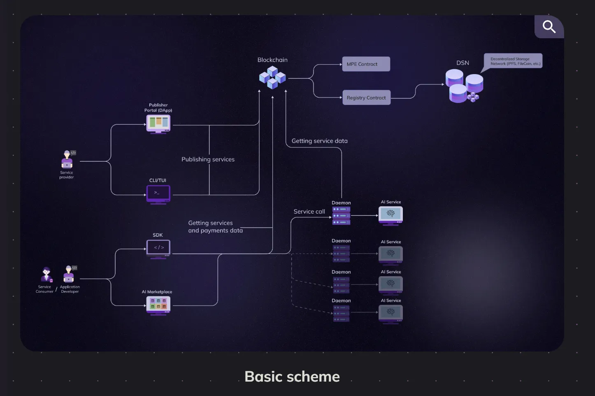

Welcome to the [SingularityNET Developer Portal](https://dev.singularitynet.io)

Our Developer Portal provides documentation about the main products of SingularityNET


## Contributing
We are glad to see new contributors!
If you want to add a new document or request any edits, please:
1. Create a fork of this repo
2. Open the pull request to `development` branch with your edits

## Setup

For start development you need:

-   node 18.0.0 || >=20.0.0
-   npm >=8.0.0

Copy repository:

```sh
git clone https://github.com/singnet/dev-portal.git
```

```sh
cd dev-portal
```

then install dependencies:

```sh
npm install
```

and run project:

```sh
npm run dev
```

## Update/Add Documents

If you want to update the documentation, change the corresponding files in `/docs/products/`. To add documentation files, place them in the appropriate product section and do not forget to add them to the sidebar (add the data to the `/config/content/sidebarContentConfig.ts` to the appropriate section). If a new documentation page requires images, add them to the appropriate folder in `/assets/images/`

Dev-portal-2 uses a library module with clean-URLs and for its correct operation it is necessary to store documents correctly.

Add all documents in individual folders and the entry point must be a file index.md
As shown in the diagram:

```
├─ getting-started
│  └─ index.md
├─ installation
│  └─ index.md
└─ index.md
```

If there are other files inside the folder, except index.md then the name of this folder should start with a capital letter. Otherwise, with lowercase.

### Add an image

To add an image to your document, please follow these steps:

1. Upload the file to `public/assets/images/products/name_of_product/name_of_subcategory/title_image`
2. Add next code:

```javascript
<ImageViewer
    src='/assets/images/products/path_to_your_file'
    alt='alt for image'
/>
```

If you want to add a description to an image, you should use the `pictureTitle` attribute. For example:

```javascript
<ImageViewer
    src='/assets/images/products/AIMarketplace/Marketplace/BasicScheme.webp'
    alt='Basic scheme'
    pictureTitle='Basic scheme'
/>
```

Result:


### Add a video

To add a video to your document, please follow these steps:

1. Upload the file to `public/assets/images/products/name_of_product/name_of_subcategory/title_image`
2. Add next code:

```javascript
<Video src="'/assets/images/products/path_to_your_file'" />
```

## Add new component

If you want to add a new one .vue component, you need to add these files to the appropriate folder in the `/components/` section or create a new folder if the existing ones are not suitable. Do not forget import new components in `/.vitepress/theme/index.ts`

Example:

```ts
...
import YourComponent from "/components/folder/YourComponent.vue";

export default {
    ...
    enhanceApp({ app, router, siteData }) {
        app.component("YourComponent", YourComponent);
        ...
    },
}
```

The default theme's <Layout/> component has a few slots that can be used to inject content at certain locations of the page. Check full list of slots here: https://vitepress.dev/guide/extending-default-theme#layout-slots

```ts
export default {
    extends: DefaultTheme,
    Layout: () => {
        return h(DefaultTheme.Layout, null, {
            "some-layout": () => h(YourComponent)
            ...
        });
    },
    ...
}
```

## Update existing config

if you want to change an existing config, you need to find the required file in the `/config/content` folder and change the required part. **Important**: Each config file has its own structure and in order not to cause conflicts, you need to adhere to it.
Also, some config files require an icon, they need to be added to an existing file (`/assets/images/sprite.svg`) and add an id to them

Example of adding an icon to a `sprite.svg`

```html
<svg xmlns="http://www.w3.org/2000/svg" style="display:none;">
    ...
    <symbol id="YourIconID" width="16" height="18" viewBox="0 0 16 18">
        <path
            d="M7.71429 10.2857C6.57764 10.2857 5.48756 9.83418 4.68383 9.03046C3.8801 8.22673 3.42857 7.13664 3.42857 6H5.14286C5.14286 6.68199 5.41377 7.33604 5.89601 7.81827C6.37825 8.30051 7.0323 8.57143 7.71429 8.57143C8.39627 8.57143 9.05032 8.30051 9.53256 7.81827C10.0148 7.33604 10.2857 6.68199 10.2857 6H12C12 7.13664 11.5485 8.22673 10.7447 9.03046C9.94102 9.83418 8.85093 10.2857 7.71429 10.2857ZM7.71429 1.71429C8.39627 1.71429 9.05032 1.9852 9.53256 2.46744C10.0148 2.94968 10.2857 3.60373 10.2857 4.28571H5.14286C5.14286 3.60373 5.41377 2.94968 5.89601 2.46744C6.37825 1.9852 7.0323 1.71429 7.71429 1.71429ZM13.7143 4.28571H12C12 3.72291 11.8891 3.16561 11.6738 2.64564C11.4584 2.12568 11.1427 1.65322 10.7447 1.25526C10.3468 0.857291 9.87432 0.541608 9.35436 0.326231C8.83439 0.110853 8.27709 0 7.71429 0C6.57764 0 5.48756 0.451529 4.68383 1.25526C3.8801 2.05898 3.42857 3.14907 3.42857 4.28571H1.71429C0.762857 4.28571 0 5.04857 0 6V16.2857C0 16.7404 0.180612 17.1764 0.502103 17.4979C0.823593 17.8194 1.25963 18 1.71429 18H13.7143C14.1689 18 14.605 17.8194 14.9265 17.4979C15.248 17.1764 15.4286 16.7404 15.4286 16.2857V6C15.4286 5.04857 14.6571 4.28571 13.7143 4.28571Z"
            fill="#4086FF"
        />
    </symbol>
    ...
</svg>
```

Usage in components:

```html
<SpriteIcon :textIconID="YourIconID" :width="'18px'" :height="'18px'" />
```
