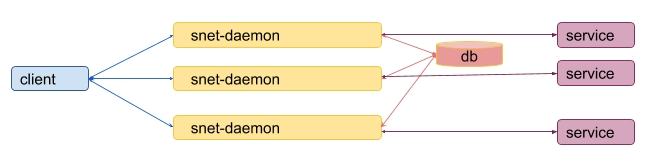

# Payment channel storage

To fulfil a request from a client to service an snet-daemon needs to store and process information about
service payment which is referred as payment channel.

If there is only one service and corresponding snet-daemon the process is easy:


if payment passes a validation process the payment channel is stored in an internal storage
to be claimed when the service successfully accomplishes the request.

The situation becomes more complicated if a service provides several replicas.
In this case it is not possible just to have several separated snet-daemons each of which has an independent
internal storage. 


One drawback of using a separated payment channel for each replica is that it can be expensive from the gas consumption 
and time execution (it really could takes relatively long time) point of view because each operation to open a channel 
requires to process it by the blockchain.

The other one is that such model is subject to an attack where the same payment can be used for services 
from different replicas.

This leads to a model where all snet-daemons for the same service should use the shared storage.



However if there is only one instance of a storage is provided it can easily become a single point of failure
for the whole system because its failures leads that all payments can't be processed even where are some alive replicas.

Next step leads us to use a distributed storage. Where are plenty of available storages and it is necessary
to choose the best suited one.

Which criteria should we followed to?

[CAP theorem](https://en.wikipedia.org/wiki/CAP_theorem) gives us a choice to select only two out
of three main guarantees:
* Partition tolerance
* Availability
* Consistency

We need a partition tolerance distribute storage to save system from network failures.
Definitely the chosen storage needs to provide strong consistency guarantees to avoid a situation where the same
payment is used twice on different replicas.

No way, availability guarantee should be turned down. It means if all but a few nodes of the distributed storage are
still available it will not be able to serve read/write requests. This is a price which we need to pay to have a
strong consistency storage system.

Lets strike out the availability guarantee and leave only partition tolerance and consistency:

* Partition tolerance
* ~~Availability~~
* Consistency


The new design now looks like:


The current approach is fine but it requires for a service owner not only setup an snet-daemon for each replica 
but also to deploy a separated distributed storage. This can be rather tedious and complicated task.
To avoid this it would be good to incorporate the distributed storage nodes into snet-daemons so it would be the
snet-daemon task to run required distributed storage nodes:


## Considered storages

We are looking for a distributed storage with strong consistence guarantee which can be run by snet-daemon
(e. g. easily integrated into Go program).

Some storages which were considered:

| Distributed Storage                            |Language| Consensus|Embedded Server Support 
|------------------------------------------------|--------|----------|--------------------------------------------
|[Etcd](https://github.com/etcd-io/etcd)         | Go     | Raft     |[native](https://godoc.org/github.com/coreos/etcd/embed)
|[Consul](https://github.com/hashicorp/consul)   | Go     | Raft     |[ticket 467](https://github.com/hashicorp/consul/issues/467)
|[ZooKeeper](https://github.com/apache/zookeeper)| Java   | ZAB      |[native](https://zookeeper.apache.org/doc/r3.4.6/api/org/apache/zookeeper/server/ZooKeeperServerMain.html)


Etcd was chosen because it is written in Go and has out of the box embedded server support.
It means that its nodes can be started and stopped by snet-daemon replicas.

It is not clear is it possible to run consul server agent from a Go application.
A few examples (embedded-consul
[1](https://github.com/golovnin/embedded-consul)
[2](https://github.com/pszymczyk/embedded-consul))
just bundles the Consul as a binary package.

Zookeeper is just written in Java and it requires to have an additional support to start Zookeeper nodes from Go.

`Note`: all these storages use a quorum to get a consensus during leader election and values writings.
It means that if number of failed nodes more than half of all nodes then the the cluster stops working.
As it was described before it is cost for a distributed system to provide strong consistency guarantee.

## Etcd storage

### Running and accessing embedded etcd cluster

Starting an etcd node requires at least the following parameters:

* **name**: human-readable name for the node.
* **listen-client-urls**: list of URLs to listen on for client traffic
* **listen-peer-urls**: list of URLs to listen on for peer traffic
* **initial-cluster**: initial cluster configuration for bootstrapping, for example
  ```name1=http://AAA.BBB.1.1:2380,name2=http://AAA.BBB.1.2:2380```
* **initial-cluster-token**: initial cluster token for the etcd cluster during bootstrap


The following Go code is used to start etcd node and use etcd client:
* [etcd_storage_server.go](src/etcddb/etcd_storage_server.go)
* [etcd_storage_client.go](src/etcddb/etcd_storage_client.go)

There are some [throughput tests](src/etcddb)
which runs several etcd nodes locally and measure number of writes, and compare and set requests per seconds.

Note: because all etcd nodes were run locally the results can be differ from that when each etcd node is run on its
own separated server.

### etcd cluster size

According to the [etcd FAQ](https://coreos.com/etcd/docs/latest/faq.html) it is suggested to have
odd number of etcd nodes in a cluster, usually 3 or 5.
It also mentions that "*Although larger clusters provide better fault tolerance, the write performance suffers
because data must be replicated across more machines.*"

##  Proposed solutions


The following solutions are based on the embedded etcd storage discussed in details in chapters below:
* Command line etcd cluster creation
* Fixed size etcd cluster
* Incremental etcd cluster creation


### Command line etcd cluster creation

This approach is to add a command line option to snet-cli which allows to start an etcd instance
as part of etcd cluster

> snet storage init --name name --token unique-token --client-url http://AAA.BBB.1.1:2379 --peer-url http://AAA.BBB.1.1:2380 --initial-cluster name1=http://AAA.BBB.1.1:2380,name2=http://AAA.BBB.1.2:2380

The list of client-urls then needs to be passed to each replica to have access to the etcd cluster storage.

### Fixed size etcd cluster

This approach assumes that etcd nodes are started by replicas and size of etcd cluster is fixed.
The initial configuration file contains list of all replicas and information whether it should start etcd node or not:

For example:

| replica id | start etcd node| etcd node name | etcd node client url    | etcd node peer url     |
|------------|----------------|----------------|-------------------------|------------------------|
|  replica 1 |             yes|          node1 | http://AAA.BBB.1.1:2379 | http://AAA.BBB.1.1:2380|
|  replica 2 |             yes|          node2 | http://AAA.BBB.1.2:2379 | http://AAA.BBB.1.2:2380|
|  replica 3 |              no|
|  replica 4 |             yes|          node3 | http://AAA.BBB.1.4:2379 | http://AAA.BBB.1.4:2380|
|  replica 5 |              no|

Such configuration requires that all replicas which maintain an etcd node needs to be started first
to have functional etcd cluster.

### Incremental etcd cluster creation approach

Starting etcd cluster requires that initial size of the cluster was defined during cluster bootstrap.
It means that the cluster begins to work only when quorum number of nodes join the cluster.

Suppose there are 3 replicas and they want to run 3 ectd nodes.
When the first replicas starts etcd node it is not able to write and read from the etcd because 2 others
one more etcd node joins the cluster.

As an alternative it is suggested that the first replica starts with etcd cluster which consists of only one etcd node.
In this case it will be able to write and records to the etcd.
When the second replica starts it can find the existed etcd cluster (using the address of the first replica)
and just adds the second node to the cluster.

This allows to have the working etcd cluster even only some of all replicas are running.

Note: etcd has [Discovery Service Protocol](https://coreos.com/etcd/docs/latest/v2/discovery_protocol.html).
It is only used in cluster bootstrap phase, and cannot be used for runtime reconfiguration.

The following algorithm describes creating and updating etcd cluster during replicas starting
based on incremental approach.

#### Input

Each replica needs to have access to the following info which is provided during the replica starting:
* etcd cluster token value
* list of all replicas with corresponding values:
  * replica id
  * etcd node name
  * etcd ip address
  * ectd client and peer ports

#### Cluster Configuration Table

The table with the given columns will be maintained in etcd cluster:
* replica id
* timestamp
* running etcd server node flag

The last field indicates that a replica started etcd server instance and it had been alive at the time when the
record to the Cluster Configuration Table was written.

#### Replicas to etcd nodes correspondence

Each replica can use the predefined function which return number of etcd nodes which are necessary to run
for the given number of live replicas.

The function can be described in pseudocode like:
```
numberOfEtcdNodes(numberOfReplicas) {
    1, 2   -> 1
    3, 4   -> 3
    5, ... -> 5
}
```

#### Detecting added and failed replicas

Heartbeat mechanism is suggested to use for replicas failing detection.

Each replica needs to repeatedly write an actual timestamp using the replica id as a key
to the **Cluster Configuration Table**.

If difference between current time and a replica is higher than a certain threshold the replica
is considered as dead.

#### Detecting failed etcd nodes

etcd [Admin API Documentation](https://coreos.com/etcd/docs/latest/v2/other_apis.html#checking-health-of-an-etcd-member-node)
provides REST api to check health of etcd node

#### Initial state

The first running replica finds that there is no an etcd cluster and starts an embedded etcd instance.

#### Main loop

Each replica reads the **Cluster Configuration Table**, checks number of alive replicas and calculates
number of required etcd nodes using the *numberOfEtcdNodes(numberOfReplicas)* function.

If number of required etcd nodes is less than current number of alive etcd nodes then only one replica
with the lowest id which does not have running embedded etcd node starts it and adds this node to the current cluster.

There are can be two results:
* The embedded etcd is successfully run
* The replica which starts etcd misses the timeout and is considered as dead

If the ectd node starting succeed the replica adds the record to the **Cluster Configuration Table**
that it has running ectd node.

In both cases the process can be just repeated as is.
